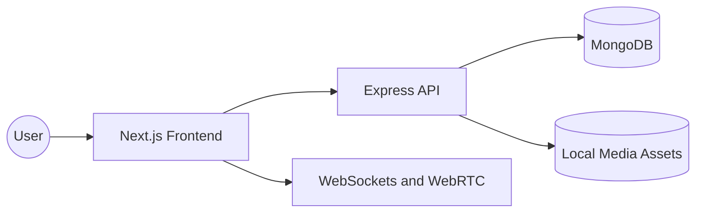

# Influx

A self-hosted, private media server with real-time social experiences — built for friends and family.

---

## What the project does

**Influx** is a production-grade, self-hosted media platform that combines media streaming with real-time social features. It allows users to:

- **Stream Media**: High-quality streaming of Movies and TV shows.
- **Watch Parties**: Synchronized playback for groups with real-time drift correction.
- **Global Chat**: Persistent server-wide messaging.
- **Voice & Video**: Integrated WebRTC-based communication within watch rooms.
- **Secure Access**: Admin-controlled, invite-only user management.

## Why it exists

In an era of fragmented streaming services and data privacy concerns, Influx offers a **private, always-on digital space**.

- **Ownership**: You own your data and your hardware.
- **Zero-Trust**: Designed with a secure architecture where admin has full control.
- **Social Connection**: Built to bridge the gap between solo streaming and physical watch parties without relying on third-party platforms.

## Tech Stack

### Frontend

- **Framework**: Next.js (App Router)
- **Language**: TypeScript
- **Styling**: Tailwind CSS
- **State Management**: Zustand
- **Media Playback**: Plyr

### Backend

- **Framework**: Express.js
- **Runtime**: Node.js
- **Database**: MongoDB (Mongoose ODM)
- **Auth**: JWT + HTTP-Only Cookies
- **Logging**: Bunyan

## High-level Architecture

Influx uses a decoupled **Client-Server architecture**:



- **Frontend**: Handles the UI/UX and client-side logic.
- **Backend**: Manages business logic, authentication, and database interactions.
- **Real-time Layer**: (Planned) Handles synchronization and communication via WebSockets.

## Folder Structure

```text
influx_new/
├── client/          # Next.js frontend application
│   ├── app/         # App router, pages, and components
│   └── public/      # Static assets
├── server/          # Express.js backend API
│   ├── src/         # Source code (Controllers, Models, Routes)
│   └── dist/        # Compiled production code
└── README.md        # Root documentation
```

## How to run the full project

### Prerequisites

- Node.js (v18+)
- MongoDB (Local or Atlas)
- npm or yarn

### 1. Setup Backend

```bash
cd server
cp .env.example .env  # Configure your MONGO_DB_URI and JWT_SECRET
npm install
npm run dev
```

### 2. Setup Frontend

```bash
cd client
npm install
npm run dev
```

The application will be available at:

- Frontend: `http://localhost:3000`
- Backend API: `http://localhost:5000`
